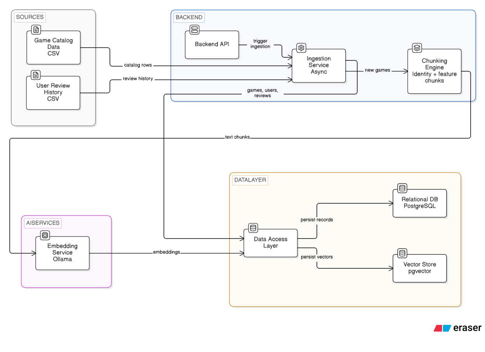
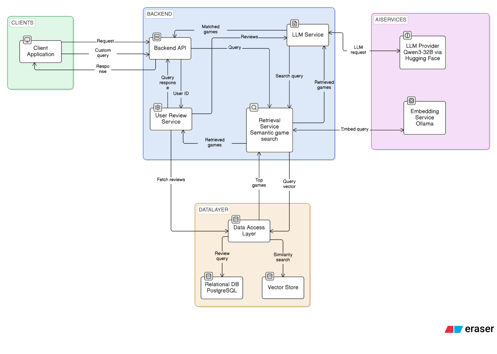
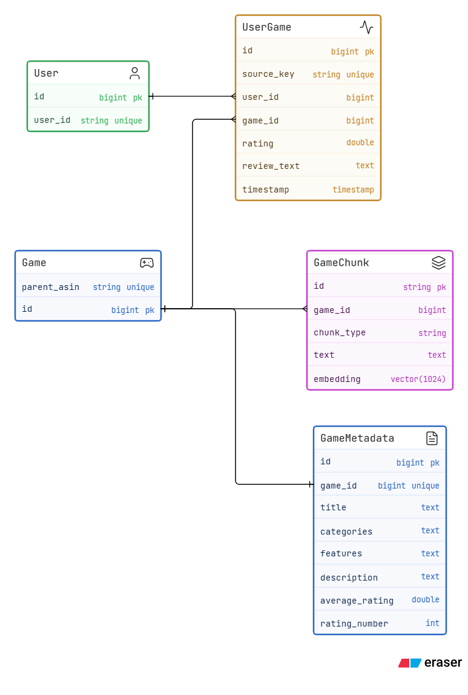

# GameSense: Content-Based Game Discovery Using RAG

**GameSense** is a Spring Boot service that recommends video games from a user's own review history or from a custom search query they write themselves. It combines LLM-generated search queries, text embeddings, and PostgreSQL/pgvector similarity search.

## 1. Project Overview

GameSense supports two ways to find games:

- **Review-based:** For a given user ID, GameSense selects up to three recent or three highest-rated reviews, fetches each one together with the metadata of the reviewed game, and asks a chat model to summarize the user's taste as a game-search query.
- **Custom query:** Users can skip their history and type their own search query, such as "open-world RPG with a deep crafting system".

In both modes, the query is embedded and matched against game chunks through vector search. The API returns the query and a ranked list of games. The project also includes CSV ingestion and retrieval evaluation flows.

**Result:** ~70% LLM-judged precision across 200 users on a catalog of ~7,100 games.

## 2. Problem Statement

Game catalogs are large, and finding a title that matches a player's taste is difficult with genre filters and keyword search alone. Players describe what they enjoy in their reviews in terms of mechanics, themes, and tone, such as "tight stealth gameplay with a moody atmosphere", which broad categories like "Action" do not capture.

GameSense explores a content-based approach to this problem using Retrieval-Augmented Generation (RAG). It turns a user's reviews and the metadata of the games they reviewed, or a query they write themselves, into a natural-language search query, then retrieves semantically similar games through vector search over embedded game content (title, categories, and features). Because matching relies on game content rather than other users' behavior, it does not depend on a large pool of interaction data. The approach is evaluated on a subset of Amazon video game reviews (see Dataset & Results below).

## 3. Dataset & Results

**Dataset:** Amazon Reviews, Video Games category, filtered to:

| Item | Count |
| --- | --- |
| Users | 2,500 |
| User-game interactions (reviews) | ~20,000 |
| Games | ~7,100 |
| Embedded text chunks | ~36,000 |

**Evaluation:** For 200 users, GameSense generated recommendations in two modes (recent reviews and top-rated reviews), returning the top 3 games each time. An LLM judge rated the relevance of each recommendation against the user's review history, giving **~70% precision**.

> Precision is measured with an LLM judge, which approximates but does not replace human evaluation.

## 4. Key Features

- **Review-based recommendations:** Suggests games from a user's recent or highest-rated reviews (up to three), combined with the metadata of the reviewed games, so recommendations reflect both what the user wrote and what they played.
- **Custom query search:** Users can type their own query and get matching games without any review history.
- **LLM query generation:** A chat model (`Qwen/Qwen3-32B`) condenses review text into a concise, searchable description of the user's taste.
- **Semantic search with pgvector:** Ranks games by cosine similarity over 1,024-dimensional embeddings, so matches go beyond exact keywords.
- **Content-aware chunking:** Each game gets an identity chunk (title and categories) plus feature chunks, with short and boilerplate features filtered out.
- **Asynchronous CSV ingestion:** Loads the game catalog and review history in the background and skips duplicate games and reviews, so re-runs are safe.
- **Built-in evaluation:** Endpoints for LLM relevance judgements and precision summaries make retrieval quality measurable.
- **Resilient LLM calls:** Retries with exponential backoff handle temporary API failures.

## 5. System Architecture

The Spring Boot API coordinates CSV ingestion, review selection, LLM calls, embeddings, and persistence. PostgreSQL stores relational entities and pgvector embeddings; Ollama provides embeddings and Hugging Face provides chat completions.

### Ingestion architecture



### Live retrieval architecture



### Database schema



## 6. Architecture Components

| Component | Responsibility |
| --- | --- |
| REST controller | Exposes ingestion, recommendation, and evaluation endpoints. |
| Data ingestion service | Reads CSV rows, maps records, and persists games and reviews. |
| Chunking service | Creates identity and filtered feature chunks per game. |
| Embedding service | Uses Ollama to embed game chunks and search queries. |
| User review service | Selects recent or top-rated reviews with their game metadata and coordinates the recommendation flow. |
| LLM service | Calls Hugging Face for query generation and relevance judgements, with retries. |
| Retrieval service | Runs vector similarity search via the repository. |
| Repositories / entities | JPA persistence and native pgvector query over game chunks. |
| Dataset script | Filters the source data and writes the CSV files used for ingestion. |

## 7. Data / Ingestion Pipeline

1. Put `games_metadata.csv` and `history.csv` under the configured data directory.
2. Start catalog ingestion. CSV rows map to a game and metadata entity.
3. Create an identity chunk from title and categories, and feature chunks from pipe-separated features. Short and common boilerplate features are filtered out.
4. Generate an embedding for each chunk with Ollama and save the game, metadata, chunks, and vectors.
5. Start history ingestion after catalog ingestion. Each review resolves its game by `parent_asin`, creates the user if needed, then saves rating, text, source key, and timestamp.
6. Existing catalog IDs and review source keys are skipped.

The history CSV needs `user_id`, `parent_asin`, `rating`, `review_text`, and `timestamp`.

## 8. Retrieval / Query Pipeline

1. The client submits a user ID to a recommendation endpoint.
2. The service fetches up to three recent or top-rated reviews from PostgreSQL, along with the metadata of each reviewed game.
3. Hugging Face chat completions produce a concise search query from the reviews and game metadata.
4. Ollama embeds the query.
5. PostgreSQL ranks the nearest chunks by cosine distance, considers up to 100 chunks, groups them by game, and returns the configured top-K games (default 3).
6. The API responds with the generated query and game details.

## 9. Data Flow

```mermaid
flowchart LR
    A[Catalog and history CSV] --> B[CSV reader and mapper]
    B --> C[Ingestion service]
    C --> D[Chunking service]
    D --> E[Ollama embeddings]
    E --> F[(PostgreSQL + pgvector)]
    G[Client user ID] --> H[Review selection]
    H --> I[Hugging Face query generation]
    I --> J[Ollama query embedding]
    J --> K[pgvector cosine similarity]
    F --> K
    K --> L[Ranked recommendations]
    L --> G
```



## 10. Embedding & Semantic Search

Each game has an identity chunk made from its title and categories, plus chunks for qualifying individual features prefixed with the title. Ollama embeds the chunks at ingestion and embeds the generated query at retrieval. A native PostgreSQL query uses pgvector cosine distance (`<=>`), selects up to 100 nearest chunks, groups them by game using the minimum distance, and returns up to the configured top-K (3 by default).

## 11. LLM Integration

Hugging Face chat completions use `Qwen/Qwen3-32B` by default to turn review context into a search query. Evaluation uses the same chat model to judge retrieved results. The API key comes from `HF_API_KEY`, and retry policies use exponential backoff. Embeddings are handled separately by Ollama through Spring AI.

## 12. Technology Stack

- Java 17; Spring Boot 4.1.1
- Spring Web, Spring Data JPA, Hibernate
- PostgreSQL 17 with pgvector
- Spring AI and Ollama (`qwen3-embedding:0.6b`)
- Hugging Face chat completions (`Qwen/Qwen3-32B`)
- Apache Commons CSV; Spring Retry; Maven Wrapper; Docker Compose

## 13. Project Structure

```text
.
├── README.md
└── Game-sense/
    ├── Backend/
    │   ├── pom.xml
    │   ├── docker-compose.yaml
    │   └── src/main/
    │       ├── java/com/siddu/gamesense/
    │       │   ├── Config/       # configuration
    │       │   ├── Entities/     # JPA entities
    │       │   ├── controller/   # REST API
    │       │   ├── dto/          # API, CSV, and model data
    │       │   ├── repository/   # persistence and vector query
    │       │   ├── services/     # ingestion, retrieval, LLM, evaluation
    │       │   └── utils/        # CSV, prompts, mapping, evaluation
    │       └── resources/application.yaml
    ├── docs/                     # architecture and schema PNGs
    └── script/script.py          # source data filtering and CSV preparation
```

## 14. Prerequisites

- JDK 17 or newer.
- Docker and Docker Compose.
- Ollama running at `http://localhost:11434` with the configured embedding model.
- A Hugging Face token with access to the configured chat model.
- CSV input data in the configured data directory.

## 15. Installation & Setup

From the repository root, enter the backend directory and set the required variables in PowerShell:

```powershell
cd Game-sense/Backend
$env:DB_USERNAME = "postgres"
$env:DB_PASSWORD = "<your-local-database-password>"
$env:HF_API_KEY = "<your-hugging-face-token>"
```

Place `games_metadata.csv` and `history.csv` in `Game-sense/data/` when running from `Game-sense/Backend`. The default data path is `../data/`. The evaluation user list (`evaluation_users.csv`) is generated from `history.csv` by an API endpoint, so you don't need to prepare it yourself.

### Environment variables

| Variable | Required | Purpose | Default |
| --- | --- | --- | --- |
| `DB_USERNAME` | Yes | PostgreSQL username | none |
| `DB_PASSWORD` | Yes | PostgreSQL password | none |
| `HF_API_KEY` | Yes | Hugging Face API token | none |
| `SPRING_DATASOURCE_URL` | No | JDBC URL override | `jdbc:postgresql://localhost:5433/GameSense_Database` |

The Ollama URL, model names, data path, vector dimension, and top-K are set in `Backend/src/main/resources/application.yaml`.

## 16. Database Setup

From `Game-sense/Backend`, launch the pgvector-enabled PostgreSQL 17 service:

```powershell
docker compose up -d postgres
```

It publishes port `5433`, uses database `GameSense_Database` and user `postgres`, and persists data in `Backend/gamesense_data`. Set `DB_PASSWORD` to the same password as the local Compose service, or update the Compose configuration to your local credentials. Hibernate uses `ddl-auto: update` to create and update tables. The configured embedding model must return vectors of dimension 1,024.

## 17. Running the Application

Fetch the embedding model, then run the app from `Game-sense/Backend` with the required environment variables set:

```powershell
ollama pull qwen3-embedding:0.6b
./mvnw.cmd spring-boot:run
```

The API listens on port 8080 by default. Run catalog ingestion before history ingestion:

```powershell
curl.exe -X POST http://localhost:8080/gamesense/metadata-ingest
curl.exe -X POST http://localhost:8080/gamesense/users-ingest
```

## 18. API Endpoints

| Method | Endpoint | Request | Purpose |
| --- | --- | --- | --- |
| POST | `/gamesense/metadata-ingest` | None | Asynchronously ingest the game catalog. |
| POST | `/gamesense/users-ingest` | None | Asynchronously ingest review history. |
| POST | `/gamesense/games/recent_recommendation` | `{"userId":"..."}` | Recommend using recent reviews. |
| POST | `/gamesense/games/top_rated_recommendation` | `{"userId":"..."}` | Recommend using highest-rated reviews. |
| POST | `/gamesense/games/evaluation` | None | Start evaluation from `evaluation_users.csv`. |
| POST | `/gamesense/games/evalution_users` | None | Generate the evaluation user list from `history.csv`. |
| POST | `/gamesense/games/evaluate_precision` | None | Calculate precision from saved results. |

Recommendation request example:

```json
{"userId":"your-user-id"}
```

Ingestion and evaluation start endpoints return HTTP 202. Recommendation endpoints return the generated query and recommendations. A user with no reviews currently yields a null result.

## 19. Configuration

Main settings live in `Game-sense/Backend/src/main/resources/application.yaml`.

| Setting | Default |
| --- | --- |
| Port | `8080` (Spring Boot default) |
| Database URL | `jdbc:postgresql://localhost:5433/GameSense_Database` |
| Data path | `../data/` relative to the backend working directory |
| Ollama URL | `http://localhost:11434` |
| Embedding model / dimension | `qwen3-embedding:0.6b` / `1024` |
| Hugging Face model | `Qwen/Qwen3-32B` |
| Retrieval top-K | `3` |
| Hikari max pool size | `20` |

## 20. Future Improvements

- Add ingestion progress reporting and consistent API errors for users without review history.
- Make model names, service URLs, and retrieval settings environment-configurable.
- Benchmark retrieval quality across embedding models and chunking strategies.
- Add authentication, pagination, and monitoring for production deployment.